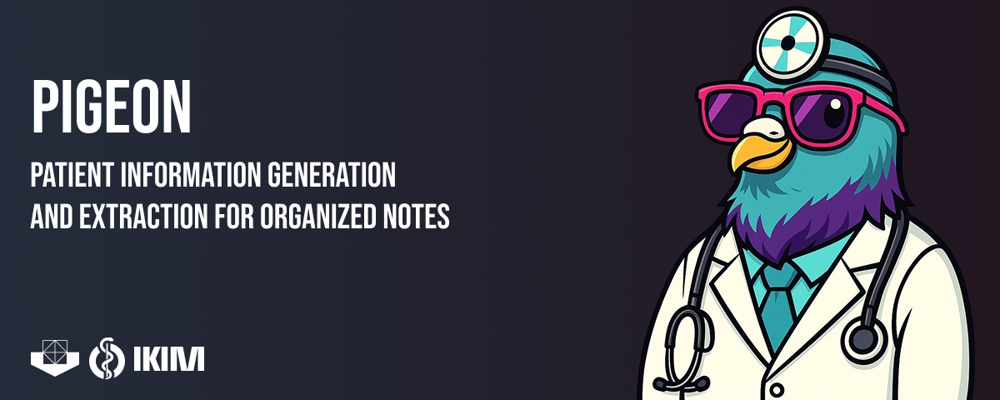

# PIGEON: Reproducibility Code

**P**atient **I**nformation **G**eneration and **E**xtraction for **O**rganized **N**otes

This repository contains the complete, reproducible pipeline for generating synthetic German medical texts from FHIR data and fine-tuning large language models for structured medical information extraction.

## Overview

PIGEON is a 7-stage pipeline plus a real-world use case:

1. **Extracts** clinical data from FHIR-compliant databases (conditions, medications, observations, procedures, patient demographics)
2. **Generates** realistic synthetic German medical documents (Arztbriefe / doctor's letters) using LLMs
3. **Prepares** training datasets with structured labels (ICD-10-GM, OPS, ATC codes)
4. **Fine-tunes** MedGemma-27B using Unsloth with LoRA adapters
5. **Runs inference** on test/real data via vLLM
6. **Corrects** predicted medical codes using RAG-based correction
7. **Evaluates** extraction quality with comprehensive metrics
8. **Use Case: OCR to FHIR R4** — Full application: PDF OCR → PIGEON extraction → RAG correction → FHIR R4 Bundle

```
FHIR Database ──> Cache ──> Synthetic Text ──> Dataset ──> Fine-tune ──> Inference ──> RAG ──> Evaluation
   Stage 1        Stage 1     Stage 2          Stage 3     Stage 4       Stage 5     Stage 6    Stage 7

                                    Use Case (Stage 8):
                    PDF Document ──> OCR ──> PIGEON Extraction ──> RAG ──> FHIR R4 Bundle
                                  (Docling)   (Fine-tuned model)         (Structured output)
```

## Repository Structure

```
reproducing-pigeon/
├── config.py                          # Central configuration (all paths, endpoints)
├── .env.example                       # Environment variable template
├── pyproject.toml                     # Dependencies (Poetry)
│
├── src/
│   ├── 1_cache_generation/            # Stage 1: FHIR data extraction
│   │   ├── queries.py                 #   SQL queries for all FHIR resource types
│   │   ├── database.py                #   PostgreSQL connection manager
│   │   └── download_fhir_data.py      #   Parallel FHIR data downloader
│   │
│   ├── 2_dataset_generation/          # Stage 2: Synthetic text generation
│   │   ├── fhir_data_loader.py        #   Loads and organizes cached FHIR data
│   │   ├── section_generators.py      #   Non-LLM section generators (diagnoses, meds, labs)
│   │   ├── llm_sections.py            #   LLM-based generators (anamnese, epikrise)
│   │   ├── tumor_extraction.py        #   Tumor documentation processing
│   │   ├── text_generator.py          #   Main orchestrator class
│   │   └── create_dataset.py          #   Entry point for dataset generation
│   │
│   ├── 3_dataset_preparation/         # Stage 3: Training data preparation
│   │   ├── postprocess.py             #   Label enrichment (ATC codes, code types)
│   │   ├── train_test_split.py        #   Patient-based train/test splitting
│   │   └── token_stats.py             #   Token length analysis
│   │
│   ├── 4_finetuning/                  # Stage 4: Model fine-tuning
│   │   └── finetune_gemma.py          #   Unsloth + LoRA fine-tuning
│   │
│   ├── 5_inference/                   # Stage 5: Model inference
│   │   └── run_inference.py           #   Async vLLM batch inference
│   │
│   ├── 6_rag_correction/             # Stage 6: RAG-based code correction
│   │   ├── base_corrector.py          #   Base RAG corrector class
│   │   ├── icd_corrector.py           #   ICD-10-GM code correction
│   │   ├── ops_corrector.py           #   OPS procedure code correction
│   │   ├── atc_corrector.py           #   ATC medication code correction
│   │   ├── unified_corrector.py       #   Unified correction interface
│   │   └── correct_codes.py           #   Batch correction script
│   │
│   ├── 7_evaluation/                  # Stage 7: Evaluation
│   │   └── evaluate.py                #   Comprehensive metrics computation
│   │
│   └── 8_use_case_ocr_to_fhir/       # Stage 8: Real-world use case
│       ├── README.md                  #   Standalone documentation
│       ├── backend/                   #   FastAPI server
│       │   ├── app.py                 #     Main API (streaming pipeline)
│       │   ├── docling_processor.py   #     PDF/OCR processing (Docling + VLM)
│       │   ├── llm_client.py          #     PIGEON model client
│       │   ├── fhir_converter.py      #     FHIR R4 resource generation
│       │   ├── icd_rag_corrector.py   #     RAG-based ICD code correction
│       │   ├── prompts.py             #     German extraction prompts
│       │   └── models.py              #     Pydantic data models
│       └── frontend/                  #   React + TypeScript UI
│           ├── src/                   #     Components, services, contexts
│           ├── package.json           #     Node dependencies
│           └── vite.config.ts         #     Build configuration
│
├── data/
│   └── sample/                        # Sample FHIR data for testing
│       └── fhir_cache/
│           ├── CONDITION/             #   Diagnosis data (ICD-10 codes)
│           ├── ENCOUNTER/             #   Hospital stay metadata
│           ├── MEDICATION_STATEMENT/   #   Medications with dosage
│           ├── OBSERVATION/           #   Lab values, vital signs
│           ├── PATIENT/               #   Demographics
│           └── PROCEDURE/             #   Clinical procedures (OPS codes)
│
└── lookups/                           # Medical code catalogs (see below)
    └── README.md                      #   Instructions for obtaining lookup tables
```

## Quick Start

### 1. Installation

```bash
git clone https://github.com/UMEssen/PIGEON.git
cd PIGEON

# Install with Poetry
pip install poetry
poetry install

# Or with pip
pip install -e .
```

### 2. Configuration

```bash
cp .env.example .env
# Edit .env with your paths and endpoints
```

### 3. Obtain Lookup Tables

The pipeline requires three medical code catalog files. See `lookups/README.md` for details:

| File | Source | Description |
|------|--------|-------------|
| `icd10gm_lookup_merged.csv` | [BfArM](https://www.bfarm.de/DE/Kodiersysteme/Klassifikationen/ICD/ICD-10-GM/) | ICD-10-GM diagnosis codes with display names |
| `ops_lookup_merged.csv` | [BfArM](https://www.bfarm.de/DE/Kodiersysteme/Klassifikationen/OPS-ICHI/OPS/) | OPS procedure codes |
| `atc_lookup_merged.csv` | [BfArM](https://www.bfarm.de/DE/Kodiersysteme/Klassifikationen/ATC/) | ATC medication codes |
| `icd10gm_lookup_with_jargon.csv` | Generated (see Stage 2 docs) | ICD codes + 3 doctor jargon variants |

### 4. Run the Pipeline

Each stage can be run independently:

```bash
# Stage 1: Extract FHIR data (requires database access)
python -m src.1_cache_generation.download_fhir_data --mode encounter --input ids.csv

# Stage 2: Generate synthetic texts
python -m src.2_dataset_generation.create_dataset --type arztbrief

# Stage 3: Prepare training data
python -m src.3_dataset_preparation.postprocess --input-dir data/datasets/generated_texts
python -m src.3_dataset_preparation.train_test_split --input merged.csv --test-size 0.1

# Stage 4: Fine-tune model
python -m src.4_finetuning.finetune_gemma

# Stage 5: Run inference
python -m src.5_inference.run_inference --input test_data.json --output results.csv

# Stage 6: Apply RAG correction
python -m src.6_rag_correction.correct_codes --input results.csv --output corrected.csv

# Stage 7: Evaluate
python -m src.7_evaluation.evaluate --predictions corrected.csv --ground-truth test_labels.csv
```

## Pipeline Details

### Stage 1: FHIR Cache Generation

Extracts clinical data from a FHIR-compliant PostgreSQL database into per-encounter/patient CSV files, one CSV per resource type.

> **⚠️ Reproducibility note — Stage 1 is infrastructure-specific.**
> The SQL in `src/1_cache_generation/queries.py` was written against an **internal PostgreSQL-backed FHIR store** that is **not publicly available**. The cryptic column aliases you'll see in these queries (e.g. `ccc0_codes`, `mcc0.display_list`, `ov0_value`) are **auto-generated aliases from that store's internal FHIR-to-SQL flattening** — they encode the nested path into a resource (roughly: resource → `code` → `coding` → index `0`), not standard FHIR field names. They will **not** exist on any other FHIR backend.
>
> **You do not need to run Stage 1 to use this repository.** Stages 2–7 run entirely on the CSV cache. If you don't have this specific database, use the sample cache in `data/sample/` (see [Reproduce with your own FHIR server](#reproduce-with-your-own-fhir-server) below to produce your own).

The queries target these FHIR resource types (internal column alias → what it represents):

| Resource | Data Extracted | Internal Aliases |
|----------|---------------|-------------|
| **Condition** | Diagnoses with ICD-10-GM codes | `ccc0_codes`, `ccc0_displays`, `ccc0_1_displays`, `c0_recordedDate` |
| **MedicationStatement** | Medications with dosage schedules | `mcc0.display_list`, `md0.text_list` |
| **Observation** | Lab values, vital signs, tumor staging | `occ0.display`, `ov0_value`, `ov0_unit`, `oi0_system` |
| **Procedure** | Clinical procedures with OPS codes | `pcc0_display`, `pcc0_code` |
| **Patient** | Demographics | `pn0.family`, `png0_value`, `p0.birthDate`, `p0.gender` |
| **Encounter** | Hospital stay metadata | `ep0_start_max`, `ep0_end_max`, `distinct_etc0_display` |

#### Reproduce with your own FHIR server

If you have a standard FHIR server (e.g. HAPI FHIR, or any FHIR R4 REST endpoint), you can rebuild the same cache without the internal SQL. Query each resource by encounter/patient and map the fields with **FHIRPath** as follows, then write one CSV per resource type into `data/fhir_cache/` using the column names Stage 2 expects (see `data/sample/` for the exact CSV schemas):

| Cache field | FHIRPath on the source resource |
|-------------|--------------------------------|
| Diagnosis code / display | `Condition.code.coding.code` / `Condition.code.coding.display` |
| Diagnosis date | `Condition.recordedDate` |
| Medication display | `MedicationStatement.medicationCodeableConcept.coding.display` |
| Medication dosage text | `MedicationStatement.dosage.text` |
| Observation name / value / unit / system | `Observation.code.coding.display` / `Observation.valueQuantity.value` / `Observation.valueQuantity.unit` / `Observation.code.coding.system` |
| Procedure code / display | `Procedure.code.coding.code` / `Procedure.code.coding.display` |
| Patient name / given / birth date / gender | `Patient.name.family` / `Patient.name.given` / `Patient.birthDate` / `Patient.gender` |
| Encounter start / end | `Encounter.period.start` / `Encounter.period.end` |

A typical approach: fetch resources with a REST search (e.g. `GET [base]/Condition?encounter=[id]`), evaluate the FHIRPath expressions above with any FHIRPath library, and emit the CSV columns shown in `data/sample/`. Only the extraction layer (Stage 1) changes; Stages 2–7 are unaffected.

> **Note**: If you just want to try the pipeline, the sample data in `data/sample/` lets you run Stages 2–7 with no FHIR backend at all.

### Stage 2: Synthetic Text Generation

The core of the pipeline. Generates realistic German medical documents by:

1. **Loading FHIR data** for an encounter/patient
2. **Generating structured sections** (diagnoses, medications, labs, vital signs) using templates
3. **Generating narrative sections** (Anamnese, Epikrise) using LLM calls
4. **Assembling** sections into a complete Arztbrief with structured labels

**Key design decisions:**
- **Jargon variation**: Each ICD-10 code has 3 doctor jargon variants (colloquial medical terms), randomly selected per generation to create text diversity
- **Template diversity**: 6 medication templates, 5 lab value templates, multiple introduction templates
- **Date formatting**: Weighted random formats (mm.yyyy, year-only) with German prefixes (ED:, seit, bek.)
- **Recipe-based allocation**: A "recipe" dict controls how many data items go to each section, preventing double-use
- **LLM sections**: Anamnese and Epikrise use a secondary LLM (Qwen 3 235B) with real examples for style guidance

**Generation types:**
- `arztbrief`: Encounter-level, formal doctor's letter
- `patient_arztbrief`: Patient-level, aggregates across encounters
- `free_text`: Free-form medical text
- `vd_free_text`: Variant of free text with different structure

### Stage 3: Dataset Preparation

Transforms generated texts + labels into training-ready format:

1. **Post-processing**: Parses labels, adds ATC codes via fuzzy matching (threshold: 80), determines procedure code types (OPS vs SNOMED)
2. **Chat template formatting**: Wraps text + labels in Gemma chat template format
3. **Patient-based splitting**: Ensures no patient appears in both train and test sets (prevents data leakage)
4. **Token filtering**: Keeps examples between 500-5000 tokens

**Label Schema** (JSON):
```json
{
  "introduction": {
    "family_name": "", "given_name": "", "birth_date": "",
    "gender": "", "address_street": "", "address_city": "",
    "address_postal_code": "", "stationary_type": "",
    "encounter_start_date": "", "encounter_end_date": ""
  },
  "diagnoses": [{"type": "main_diagnosis|side_diagnosis", "name": "", "icd10gm_code": "", "date": ""}],
  "tumor_informations": [{"type": "pathological|clinical|histology|...", ...}],
  "medication": [{"medication_name": "", "dosage_info": {"Morgens": 0, "Mittags": 0, "Abends": 0, "Nacht": 0}, "atc_code": ""}],
  "lab_values": [{"lab_name": "", "lab_value": 0.0}],
  "free_text": {
    "lab_values": [], "medications": [], "body_values": [],
    "procedures": [{"procedure_name": "", "ops_code": "", "code_type": ""}],
    "diagnoses": [{"type": "", "official_name": "", "icd10gm_code": ""}]
  }
}
```

### Stage 4: Fine-tuning

Fine-tunes MedGemma-27B using:
- **Framework**: Unsloth (optimized LoRA training)
- **Method**: LoRA (r=16, alpha=16, dropout=0)
- **Quantization**: 4-bit (reduces memory to ~24GB VRAM)
- **Trainer**: SFTTrainer with `train_on_responses_only` (loss only on model output, not prompt)
- **Hyperparameters**: batch_size=4, gradient_accumulation=16, lr=2e-5, max_seq_length=8192

### Stage 5: Inference

Runs the fine-tuned model via vLLM's OpenAI-compatible API:
- Async concurrent requests (configurable, default 10)
- JSON extraction from model output with fallback parsing
- Supports both test dataset and real medical text inputs
- Parameters: temperature=0.3, top_p=0.95, max_tokens=8192

### Stage 6: RAG-based Code Correction

Post-inference correction of medical codes using Retrieval-Augmented Generation:

1. **Embed** the diagnosis/medication/procedure name
2. **Retrieve** top-10 semantically similar codes from the official catalog (FAISS + multilingual embeddings)
3. **Rerank** candidates using an LLM to select the best match

Supports three code systems:
- **ICD-10-GM**: German diagnosis codes (e.g., C34.1, I10.00)
- **OPS**: German procedure codes (e.g., 5-399.5, 8-800.c0)
- **ATC**: Medication codes (e.g., C09AA05, A10BA02)

### Stage 7: Evaluation

Computes comprehensive metrics:

| Metric Category | Metrics |
|----------------|---------|
| **Introduction** | Exact match per field (10 fields) |
| **Diagnosis codes** | Jaccard & F1 at full, 3-char prefix, and category levels |
| **Tumor information** | Per-type (11 types) Jaccard & F1 |
| **Medications** | Name match, ATC code accuracy |
| **Lab values** | Name & value matching |
| **Free text** | Per-subsection evaluation |
| **RAG impact** | Correction success rate, regression rate |

### Stage 8: Use Case — OCR to FHIR R4 (Flying Pigeon)

A full-stack application demonstrating PIGEON in a production-like setting:

1. **PDF Processing**: Docling parses digital PDFs; Qwen VLM handles scanned documents via OCR
2. **Medical Extraction**: The fine-tuned PIGEON model extracts structured data from German medical text
3. **Code Correction**: RAG-based ICD-10-GM correction using FAISS + MedGemma-4B
4. **FHIR R4 Output**: Generates a FHIR R4 Bundle with Patient, Encounter, Condition, Procedure, MedicationStatement, and Observation resources

Includes a React frontend with real-time streaming progress. See [`src/8_use_case_ocr_to_fhir/README.md`](src/8_use_case_ocr_to_fhir/README.md) for details.

```bash
# Backend
cd src/8_use_case_ocr_to_fhir/backend && uvicorn app:app --port 8003 --reload

# Frontend
cd src/8_use_case_ocr_to_fhir/frontend && npm install && npm run dev
```

## Medical Code Systems

| System | Full Name | Example | Usage |
|--------|-----------|---------|-------|
| **ICD-10-GM** | International Classification of Diseases, 10th Revision, German Modification | `C34.1` (Lung cancer, upper lobe) | Diagnoses |
| **OPS** | Operationen- und Prozedurenschlüssel | `5-399.5` (Vascular procedure) | Procedures |
| **ATC** | Anatomical Therapeutic Chemical Classification | `C09AA05` (Ramipril) | Medications |
| **SNOMED CT** | Systematized Nomenclature of Medicine | Various | Alternative procedure codes |

## Hardware Requirements

| Stage | GPU | RAM | Notes |
|-------|-----|-----|-------|
| Stage 2 (Generation) | Not required locally | 16 GB | Uses remote vLLM endpoints |
| Stage 4 (Fine-tuning) | 1x A100 80GB or 2x A6000 48GB | 64 GB | 4-bit quantization reduces VRAM needs |
| Stage 5 (Inference) | Not required locally | 16 GB | Uses remote vLLM endpoints |
| Stage 6 (RAG) | Optional (for embeddings) | 32 GB | FAISS runs on CPU |

## FHIR Data Structure

The pipeline expects FHIR data organized as per-encounter or per-patient CSV files:

```
fhir_cache/
├── fhir_cache_encounter/          # One CSV per encounter per resource type
│   ├── CONDITION/
│   │   ├── enc_id_12345.csv
│   │   └── enc_id_12346.csv
│   ├── ENCOUNTER/
│   ├── MEDICATION_STATEMENT/
│   ├── OBSERVATION/
│   ├── PATIENT/
│   └── PROCEDURE/
│
└── fhir_cache_patient/            # One CSV per patient per resource type
    ├── CONDITION/
    │   ├── pat_ABC123.csv
    │   └── pat_ABC124.csv
    ├── ENCOUNTER/
    ├── MEDICATION_STATEMENT/
    ├── OBSERVATION/
    ├── PATIENT/
    └── PROCEDURE/
```

See `data/sample/` for example CSV structures with all expected columns.

## Acknowledgments

The Stage 1 FHIR data extraction was implemented against an internal PostgreSQL-backed FHIR store using standard SQL. See the [Stage 1 reproducibility note](#stage-1-fhir-cache-generation) for how to reproduce the extraction against your own FHIR server.

## License

MIT License - see [LICENSE](LICENSE) for details.

## Citation

If you use this code in your research, please cite:


> Eryılmaz B, Arzideh K, Bahn M, Damm H, Warmer S, Schäfer H, Idrissi-Yaghir A, Pakull T, Albrecht L, Kleesiek J, Lodde G, Friedrich C, Livingstone E, Schadendorf D, Borys K, Nensa F, Hosch R
Extracting Medical Information From Unstructured Clinical Text Using Large Language Models to Enhance Health Care Interoperability: Proof-of-Concept Study
J Med Internet Res 2026;28:e92413
URL: https://www.jmir.org/2026/1/e92413
DOI: 10.2196/92413
